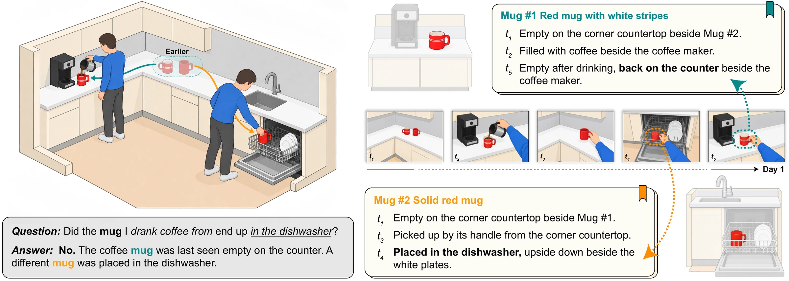
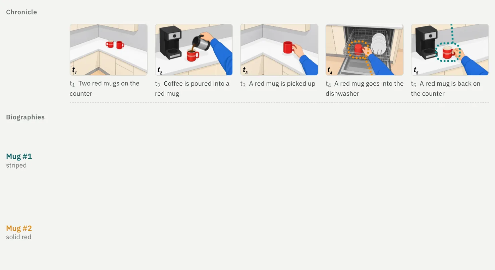
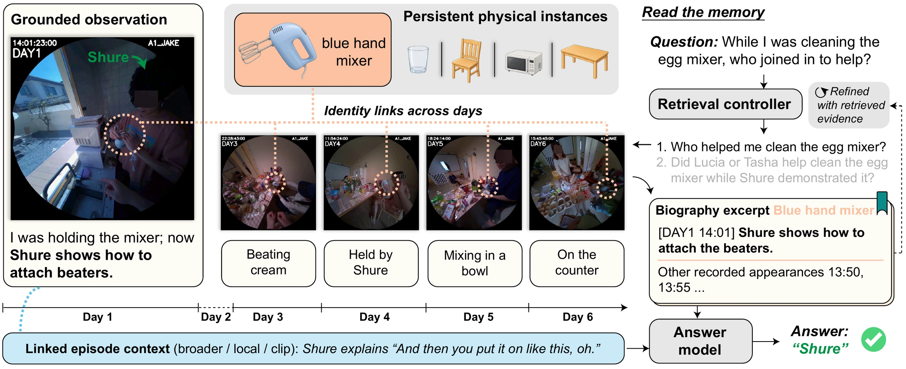
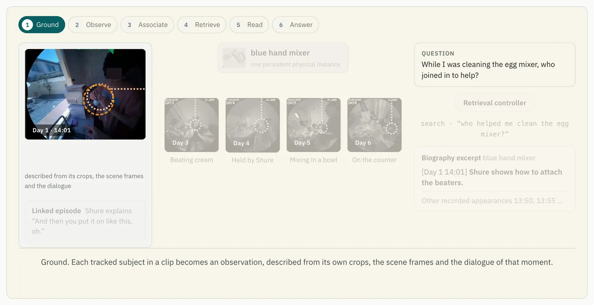
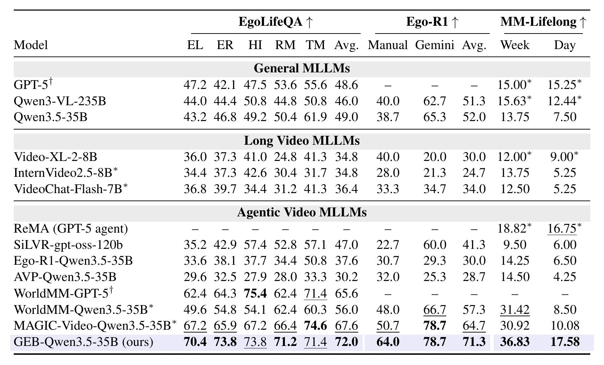

<h1 align="center">Beyond the Timeline:<br>Augmenting Long-Video Memory with Grounded Entity Biographies</h1>

<p align="center">
  <a href="https://geb-video.github.io"></a>
  <a href="https://arxiv.org/abs/2609.38155"></a>
  <a href="https://huggingface.co/papers/2609.38155"></a>
  
</p>

<p align="center">
  <a href="https://rhfeiyang.top/">Hui Ren</a><sup>1</sup>,
  <a href="https://leifan95.github.io/">Lei Fan</a><sup>2</sup>,
  <a href="https://openreview.net/profile?id=~Henry_Pao1">Henry Pao</a><sup>2</sup>,
  <a href="https://openreview.net/profile?id=~Han_Guo11">Han Guo</a><sup>2</sup>,
  <a href="http://www.zeeshanzia.com/">Zeeshan Zia</a><sup>2</sup>,
  <a href="https://openreview.net/profile?id=~Ying_Chen64">Ying Chen</a><sup>2</sup>,
  <a href="https://www.alexander-schwing.de/">Alexander G. Schwing</a><sup>1</sup>,
  <a href="https://www.ganghua.org/">Gang Hua</a><sup>2</sup><br>
  <sup>1</sup>University of Illinois Urbana-Champaign &nbsp;&nbsp; <sup>2</sup>Amazon.com, Inc.
</p>

<p align="center">
  
</p>


## Overview

Answering questions about long videos often requires connecting events involving the same objects across hours or days. Chronological descriptions and text-derived entities can leave physical identity unresolved: different objects may share a description, while observations of the same object remain disconnected across events. Retrieving relevant events therefore does not necessarily recover the *biography* of the particular entity a question concerns.

History is written in two ways, and long-video memory needs both:

- **Chronicle**: follows events through time and recalls what happened at a moment. Two accurate descriptions of "a red mug" still cannot tell whether they are the same mug.
- **Biography**: follows one subject through those events and recalls what happened to *this* mug. The coffee mug never reaches the dishwasher.

<p align="center">
  
</p>

**Grounded Entity Biographies (GEB)** is a long-video memory framework that groups visually grounded observations of the same physical instance across clips into retrievable biographies while preserving the context of each moment. During question answering, the biography is retrieved alongside episodic evidence, allowing the model to follow an entity through events using identity links established during memory construction.

<p align="center">
  
</p>

The memory is written in two steps and read in a third:

1. **Ground.** Each tracked subject in a clip becomes an observation, described from its own crops, the scene frames and the dialogue of that moment.
2. **Associate.** An observation joins an existing biography only if it matches the entity's recent references and is never seen apart from them in a shared frame; otherwise it starts a new one.
3. **Read.** Retrieval enters through a matched moment, follows same-instance edges to the rest of the biography, and reaches the episodes around each encounter. The biography excerpt also lists the appearances not yet inspected, giving the controller concrete targets for further search.

The animation follows one blue hand mixer from Day 1 to Day 6 through these steps. An interactive version is on the [project page](https://geb-video.github.io/#method).

<p align="center">
  
</p>

## Results

GEB is evaluated on four benchmarks over week-long and day-long recordings, with multiple-choice and open-ended questions: EgoLifeQA, Ego-R1-Bench, MM-Lifelong (Test@Week and Test@Day) and MultiHop-EgoQA. On EgoLifeQA it reaches 72.0% accuracy, 4.4 points above the best published result, with the same controller, answer model and retrieval limits as the strongest baseline.

<p align="center">
  
</p>

Full tables, ablations and the evidence-access analysis are on the [project page](https://geb-video.github.io) and in the [paper](https://arxiv.org/abs/2609.38155).

## Release

The code and the artifacts are coming soon. Stay tuned!

## Citation

```bibtex
@misc{ren2026GEB,
      title={Beyond the Timeline: Augmenting Long-Video Memory with Grounded Entity Biographies}, 
      author={Hui Ren and Lei Fan and Henry Pao and Han Guo and Zeeshan Zia and Ying Chen and Alexander Schwing and Gang Hua},
      year={2026},
      eprint={2609.38155},
      archivePrefix={arXiv},
      primaryClass={cs.CV},
      url={https://arxiv.org/abs/2609.38155}, 
}
```
